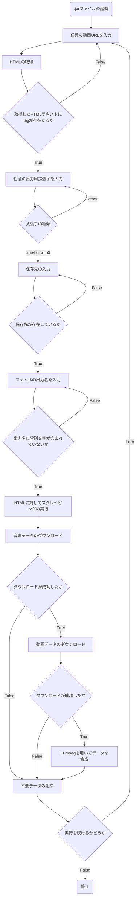

## 使用技術
       


PHP7＋MariaDB／MySQLマスターブック 永田 順伸 マイナビ出版

# cookingResipe

## プロジェクトの概要
- プロジェクトの目的 <br>
  共有サイトに実装されている，基本的な機能の実現及び，実装方法・技能の習得.

- このプログラムは，動画共有サイトYouTubeにおいて，以下の場合に該当する動画や音楽をダウンロードすることができます．
  1. YouTubeよって明示的に承認されている場合
  2. YouTubeおよび（適用される場合）各権利所持者が事前に書面で許可している場合


 
## 環境
| 言語・フレームワーク  | バージョン |
| --------------------- | ---------- |
| HTML               | HTML5    |
| CSS                | CSS3     |
| PHP                | 7.4.33   |
| MariaDB            | 10.4.27  |
| XAMPP              | 7.4.33   |
| Smarty             | 3.1.30   |


## ディレクトリ構成
```
XAMPP files
│
├── htdocs
│   ├── check_version.php
│   ├── confirmation_sign_up.css
│   ├── delete.css
│   ├── favorite.css
│   ├── images
│   │   ├── 13.jpg
│   │   └── 15.png
│   ├── index.css
│   ├── index_2.php
│   ├── js
│   │   └── quickform.js
│   ├── member_search.css
│   ├── premember_2.php
│   ├── recipe.css
│   ├── resipi_search.css
│   ├── sign_up.css
│   ├── upload_form.css
│   └── user_top.css
│
├── php_libs
│   ├── class
│   │   ├── Auth.php
│   │   ├── BaseController_2.php
│   │   ├── BaseModel.php
│   │   ├── MemberController_2.php
│   │   ├── MemberModel_2.php
│   │   ├── PrememberController_2.php
│   │   └── PrememberModel_2.php
│   ├── init.php
│   └── smarty
│       ├── templates
│       │     ├── delete.tpl
│       │     ├── favorite.tpl
│       │     ├── index.tpl
│       │     ├── premember_2.tpl
│       │     ├── recipe.tpl
│       │     ├── recipe_search.tpl
│       │     ├── sign_up.tpl
│       │     ├── upload.tpl
│       │     └── user_top.tpl
│       │

※あまりにもファイル数が多いため，実装する際に手を加えたディレクトリのみ表記
```

## 環境構築
- FFmpegのインストール
```
  $ brew install ffmpeg
```
- プロジェクトをMavanを使用して立ち上げ，Jsoupをロードする
```
<dependencies>
    <dependency>
        <groupId>org.jsoup</groupId>
        <artifactId>jsoup</artifactId>
        <version>1.16.1</version>
    </dependency>
</dependencies>
```

## 変数設計
| 変数  | 役割 | 状態 |
| --------------------- | ---------- | ---------- |
| inputURL                | 入力URLの保持     | private     |
| audioURL                | 音声データURLの保持     | private     |
| videoURL                | 映像データURLの保持     | private     |
| movieURL                | 音声+映像データURLの保持     | private     |
| htmlContent                | Jsoupで取得したHTMLの保持     | private     |
| itagAudioList                | 指定値のitagリストを保持     | private     |
| itagVideoList                | 指定値のitagリストを保持     | private     |
| itagMovieList                | 指定値のitagリストを保持     | private     |
| inputQuality                | 入力画質保持変数     | private     |
| extension                | 入力拡張子保持変数     | private     |
| workingPath                | 保存先のパスを保持     | private     |
| fileName                | 保存時のファイル名を保持     | private     |
| currentTime                | 一時保存ファイルの仮名用に現在時刻を保持     | private     |
| contentSize                | プログレスパーの表示用     | private     |


