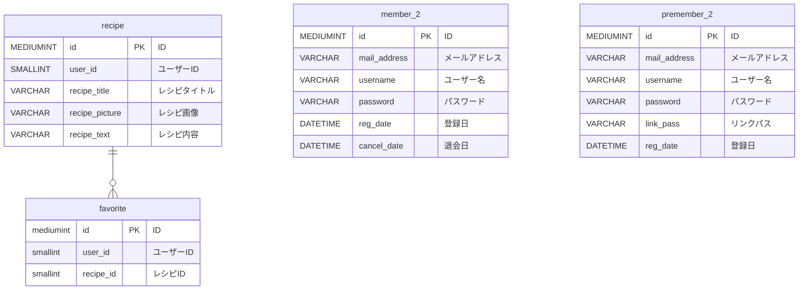

## 使用技術
        

# cookingResipe

## プロジェクトの概要
- プロジェクトの目的 <br>
  共有サイトに実装されている，基本的な機能の実現及び，実装方法・技能の習得

- プロジェクトの成り立ち<br>
  当プロジェクトは，以下の書籍
  ```
  永田順伸 『PHP7＋MariaDB／MySQLマスターブック』 マイナビ出版 2018
  ```
　に掲載されているサンプルコードをもとに，ManayaTが作成したプロジェクトである

## システム概要
　このシステムでは，以下の機能を実装している<br>
　　i.仮会員情報の登録<br>
　　ii.メールによる確認<br>
　　iii.会員情報の登録<br>
　　iV.会員画面の表示<br>
　　V.レシピの投稿<br>
　　Vi.レシピの削除<br>
　　Vii.レシピの検索<br>
　　Viii.レシピのお気に入り登録<br>

  画面一覧：https://manayat.github.io/show_cookingResipe/

## 環境
| 言語・フレームワーク　　　　　 　 | バージョン 　|
| ------------------ | -------- |
| HTML               | HTML5    |
| CSS                | CSS3     |
| PHP                | 7.4.33   |
| MariaDB            | 10.4.27  |
| MySQL              | 7.4.33   |
| XAMPP              | 7.4.33   |
| Smarty             | 3.1.30   |


## ディレクトリ構成
```
XAMPP files
│
├── htdocs
│   ├── check_version.php
│   ├── confirmation_sign_up.css
│   ├── delete.css
│   ├── favorite.css
│   ├── images
│   │   ├── 13.jpg
│   │   └── 15.png
│   ├── index.css
│   ├── index_2.php
│   ├── js
│   │   └── quickform.js
│   ├── member_search.css
│   ├── premember_2.php
│   ├── recipe.css
│   ├── resipi_search.css
│   ├── sign_up.css
│   ├── upload_form.css
│   └── user_top.css
│
├── php_libs
│   ├── class
│   │   ├── Auth.php
│   │   ├── BaseController_2.php
│   │   ├── BaseModel.php
│   │   ├── MemberController_2.php
│   │   ├── MemberModel_2.php
│   │   ├── PrememberController_2.php
│   │   └── PrememberModel_2.php
│   ├── init.php
│   └── smarty
│       ├── templates
│       │     ├── delete.tpl
│       │     ├── favorite.tpl
│       │     ├── index.tpl
│       │     ├── premember_2.tpl
│       │     ├── recipe.tpl
│       │     ├── recipe_search.tpl
│       │     ├── sign_up.tpl
│       │     ├── upload.tpl
│       │     └── user_top.tpl
│       │

※あまりにもファイル数が多いため，実装する際に手を加えたディレクトリのみ表記
```

## 環境構築
- XAMPPのインストール<br>
  SOURCEFORGEよりMac OS X用 バージョン7.4.33-0のものをインストールすること

- Apacheのセットアップ
  ```
  /Applications/XAMPP/xamppfiles
  ```
  に配置されている，httpd.confファイルにアクセスし，Apacheが使用するポートを 80 番に設定する<br>
  次に，Apacheに組み込むモジュールとして
  ```
  mod authn file.so
  ```
  を有効にする

  さらに，ServerAdminを自身のメールアドレスに設定し，ServerNameをlocalhostに設定する<br>
  続けて，DocumentRootを
  ```
  /Applications/XAMPP/xamppfiles/htdocs
  ```
  とし，当該ディレクトリに配置したPHPファイルやHTMLファイルがブラウザ上で確認できるようにする<br>
  加えて，Al-lowOverrideをAllとし，DirectoryIndexをDirectoryIndex index.php index.HTMLに設定する

- PHPの設定
  ```
    /Applications/XAMPP/xamppfiles/etc
  ```
  に配置されている，php.ini フォルダにアクセスする<br>
  そして，de- fault charset を UTF-8 に設定する<br>
  次に，date.timezoneをAsia/Tokyoに設定する.さらに，mbstringを以下のように設定する
  ```
    mbstring.language=Japanese
    mbstring.encoding translation=On
    mbstring.detect order=UTF-8
    mbstring.substitute character=none;
  ```
  加えて，セキュリティ対策としてexpose phpをoffに変更し，ヘッダからPHPのバージョンを削除するように設定する<br>
  続けて，session.sid lengthを 32 に変更し，session.sid per characterを 5 に設定する


- データベースの作成<br>
  1, MariaDBにRootユーザーでログイン
  
  2, 管理者ユーザーの作成を行う
  ```
  create user 'sample'@'localhost' identified by 'password';
  ```
  3, 作成したsampleにUSE文を使用してデータベースの作成を行う。
  ```
  create database sampledb character set utf8 collate utf8_general_ci;
  grant all privileges ON issuedb.* TO 'sample'@'localhost';
  flush privileges;
  ```
  4, 同梱の.splファイルを元に，データベースを作成する
  
  5, htdocsディレクトリのimegesフォルダに権限を与える
  ```
  chmod 777 /Applications/XAMPP/xamppfiles/htdocs/images
  ```

## 実行方法
- XAMPPの起動<br>
  i, XAMPPを起動し全てのサーバーを実行可能状態とする<br>
  ii, http://localhost/index_2.phpにアクセスする
  
- レシピ共有サイトの動作確認方法<br>
  i, 会員登録をおこなう<br>
  ii, 登録したメールアドレスとパスワードでログインを行う<br>
  iii, トップ画面に遷移後，任意のボタンをクリックし，動作確認を行う


