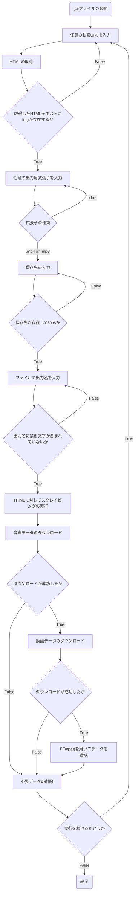

## 使用技術
    

# JavaYoutubeDownloader

## プロジェクトの概要
- このプロジェクトは教育目的で作成されたものであり，著作権の侵害や利用規約の違反を目的としたものではありません．また，上記のような利用を固く禁止します． 

- このプログラムは，動画共有サイトYouTubeにおいて，以下の場合に該当する動画や音楽をダウンロードすることができます．
  1. YouTubeよって明示的に承認されている場合
  2. YouTubeおよび（適用される場合）各権利所持者が事前に書面で許可している場合

- 現在，このプログラムは動画をダウンロードする機能が停止しています．これには，以下の理由が予測されています．<br>
  1. 動画への直接URLにおける，時間制限トークンの管理方法の変更
  2. YouTubeによる，ユーザ認証機能の仕様変更
 
## 環境
| 言語・フレームワーク  | バージョン |
| --------------------- | ---------- |
| Java                | JDK 17     |
| Jsoup                | 1.16.1      |
| FFmpeg                | 6.0      |

## ディレクトリ構成
```
.
├── out
│   └── artifacts
│       └── YouTubeDownloader_jar
│           └── YouTubeDownloader.jar
├── pom.xml
├── src
│   ├── main
│   │   ├── java
│   │   │   ├── AllByte.java
│   │   │   ├── AnalysisURL.java
│   │   │   ├── CompositionData.java
│   │   │   ├── ConnectHTML.java
│   │   │   ├── DataDownload.java
│   │   │   ├── FileDelete.java
│   │   │   ├── FileLocation.java
│   │   │   ├── InputExtension.java
│   │   │   ├── InputURL.java
│   │   │   ├── ItagAudioList.java
│   │   │   ├── ItagContains.java
│   │   │   ├── ItagMovieList.java
│   │   │   ├── ItagVideoList.java
│   │   │   ├── Manager.java
│   │   │   ├── NameSetting.java
│   │   │   ├── SelectQuality.java
│   │   │   ├── Time.java
│   │   │   └── VideoTitle.java
│   │   └── resources
│   │       └── META-INF
│   │           └── MANIFEST.MF
│   └── test
│       └── java
└── target
    ├── classes
    │   ├── AllByte.class
    │   ├── AnalysisURL.class
    │   ├── CompositionData.class
    │   ├── ConnectHTML.class
    │   ├── DataDownload.class
    │   ├── FileDelete.class
    │   ├── FileLocation.class
    │   ├── InputExtension.class
    │   ├── InputURL.class
    │   ├── ItagAudioList.class
    │   ├── ItagContains.class
    │   ├── ItagMovieList.class
    │   ├── ItagVideoList.class
    │   ├── META-INF
    │   │   └── MANIFEST.MF
    │   ├── Manager.class
    │   ├── NameSetting.class
    │   ├── SelectQuality.class
    │   ├── Time.class
    │   └── VideoTitle.class
    └── generated-sources
        └── annotations
```

## 環境構築
- FFmpegのインストール
```
  $ brew install ffmpeg
```
- プロジェクトをMavanを使用して立ち上げ，Jsoupをロードする
```
<dependencies>
    <dependency>
        <groupId>org.jsoup</groupId>
        <artifactId>jsoup</artifactId>
        <version>1.16.1</version>
    </dependency>
</dependencies>
```

## 変数設計
| 変数  | 役割 | 状態 |
| --------------------- | ---------- | ---------- |
| inputURL                | 入力URLの保持     | private     |
| audioURL                | 音声データURLの保持     | private     |
| videoURL                | 映像データURLの保持     | private     |
| movieURL                | 音声+映像データURLの保持     | private     |
| htmlContent                | Jsoupで取得したHTMLの保持     | private     |
| itagAudioList                | 指定値のitagリストを保持     | private     |
| itagVideoList                | 指定値のitagリストを保持     | private     |
| itagMovieList                | 指定値のitagリストを保持     | private     |
| inputQuality                | 入力画質保持変数     | private     |
| extension                | 入力拡張子保持変数     | private     |
| workingPath                | 保存先のパスを保持     | private     |
| fileName                | 保存時のファイル名を保持     | private     |
| currentTime                | 一時保存ファイルの仮名用に現在時刻を保持     | private     |
| contentSize                | プログレスパーの表示用     | private     |


